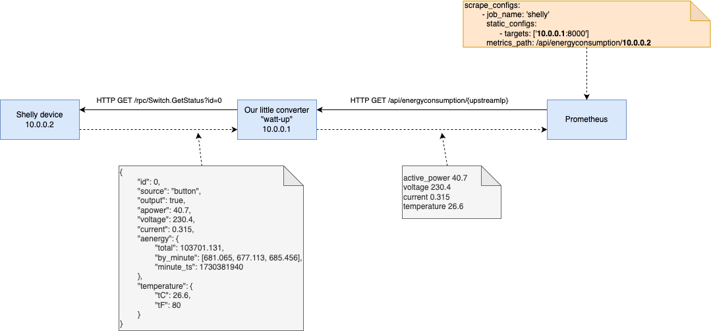

# watt-up

- [watt-up](#watt-up)
  - [Goal](#goal)
  - [All-in-one Architecture overview](#all-in-one-architecture-overview)
  - [Development](#development)
    - [Install dependencies](#install-dependencies)
    - [Run](#run)
    - [Test](#test)
  - [Deployment](#deployment)
    - [systemd service](#systemd-service)
    - [Container](#container)
  - [References](#references)


## Goal
Implement a small and convenient converter which transforms energy consumption data of a Shelly device (e.g. Shelly Plus Plug S Gen2) to scrapable Prometheus metrics.

## All-in-one Architecture overview


The flow is very simple:
- Prometheus regularly calls the configured scraping targets.
- The converter extracts the `upstream` address from the path and calls the the Shelly device directly.
- The Shelly response is filtered and reformatted and passed back to the prometheus instance.

Voila!

## Development 
### Install dependencies

```bash
pip3 install -r requirements.txt
```

### Run

```bash
python3 main.py
```

### Test

Open `http://localhost:8000/docs` to Swagger interface or `http://localhost:8000/redoc` for Redocly interface.

## Deployment
### systemd service

You can simply run this as Linux service. Adapt the template file `watt-up.service` and store it in the right location:

```bash
sudo nano /etc/systemd/system/watt-up.service
#enter systemd file content
sudo systemctl --system daemon-reload
sudo systemctl enable watt-up
sudo systemctl start watt-up
sudo systemctl status watt-up
```

### Container
Not implemented, because not needed yet.


## References
- [Shelly API reference for switches](https://shelly-api-docs.shelly.cloud/gen2/0.14/ComponentsAndServices/Switch#switchgetstatus-example)